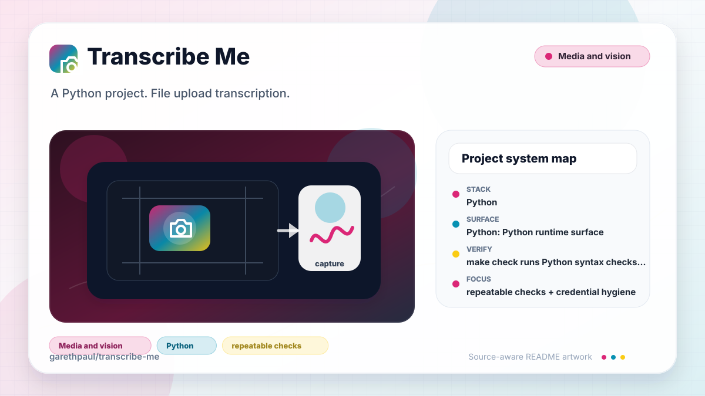

# transcribe-me

<!-- README-OVERVIEW-IMAGE -->


## Overview

`garethpaul/transcribe-me` is a Python project. File upload transcription.

This README is based on the checked-in source, manifests, scripts, and repository metadata on the `main` branch. The project language mix found during review was: Python (1).

## Repository Contents

- `requirements.txt` - Python dependency or packaging metadata
- `app.py`
- `CHANGES.md` - maintenance history for upload handling checks
- `Makefile` - local verification entry points
- `docs/plans` - completed maintenance plans for the current baseline
- `plans` - historical implementation notes
- `scripts` - documentation-plan validators
- `SECURITY.md` - security reporting and disclosure guidance
- `test-requirements.txt` - test dependency notes
- `tests` - focused Streamlit/Whisper behavior tests
- `VISION.md` - project direction and maintenance guardrails

Additional scan context:

- Source directories: no top-level source directories detected
- Dependency and build manifests: Makefile, requirements.txt, test-requirements.txt
- Entry points or build surfaces: app.py
- Test-looking files: tests/test_app.py

## Getting Started

### Prerequisites

- Git
- Python 3

### Setup

```bash
git clone https://github.com/garethpaul/transcribe-me.git
cd transcribe-me
python -m pip install -r requirements.txt
python -m pip install -r test-requirements.txt
```

The setup commands above are derived from repository files. Legacy mobile, Python, or JavaScript samples may require older SDKs or package versions than a modern workstation uses by default.

## Running or Using the Project

- Run `python -m streamlit run app.py` after installing Python dependencies.

## Testing and Verification

- `make check` runs Python syntax checks and focused tests with fake
  Streamlit/Whisper modules, including upload temp-file cleanup, suffix
  handling, unreadable/empty/oversized/non-byte upload rejection, and generic
  transcription failure reporting. Tests also require transcript text to be
  string, non-blank, trimmed, and displayed as plain text.
- `make check` also requires completed canonical plans under `docs/plans`.

When the required SDK or runtime is unavailable, use static checks and source review first, then verify on a machine that has the matching platform toolchain.

## Configuration and Secrets

- The app uses the local Whisper package and does not require an API key by
  default. First-run model downloads and any future external transcription
  service credentials should be made explicit and kept out of git.

## Security and Privacy Notes

- Review changes touching external API calls or credential-adjacent configuration; examples from the scan include requirements.txt.
- Review changes touching file, media, JSON, XML, CSV, OCR, or data parsing; examples from the scan include app.py.
- Review changes touching database, model, or persistence code; examples from the scan include app.py.

## Maintenance Notes

- See `SECURITY.md` for vulnerability reporting and safe research guidance.
- See `VISION.md` for project direction and contribution guardrails.
- See `docs/plans/2026-06-08-transcribe-me-baseline.md` for the canonical
  upload and temporary-file handling baseline.
- See `docs/plans/2026-06-08-upload-size-validation.md` for upload content and
  size validation coverage.
- See `docs/plans/2026-06-08-transcription-error-handling.md` for generic
  transcription failure handling and cleanup coverage.
- See `docs/plans/2026-06-09-transcript-text-validation.md` for transcript text
  validation coverage.
- See `docs/plans/2026-06-09-upload-bytes-validation.md` for upload payload
  type validation coverage.
- See `docs/plans/2026-06-09-upload-read-validation.md` for unreadable upload
  validation coverage.
- See `docs/plans/2026-06-09-plain-text-transcript-output.md` for transcript
  rendering coverage.

## Contributing

Keep changes small and tied to the project that is already present in this repository. For code changes, document the toolchain used, avoid committing generated dependency directories or local configuration, and update this README when setup or verification steps change.
